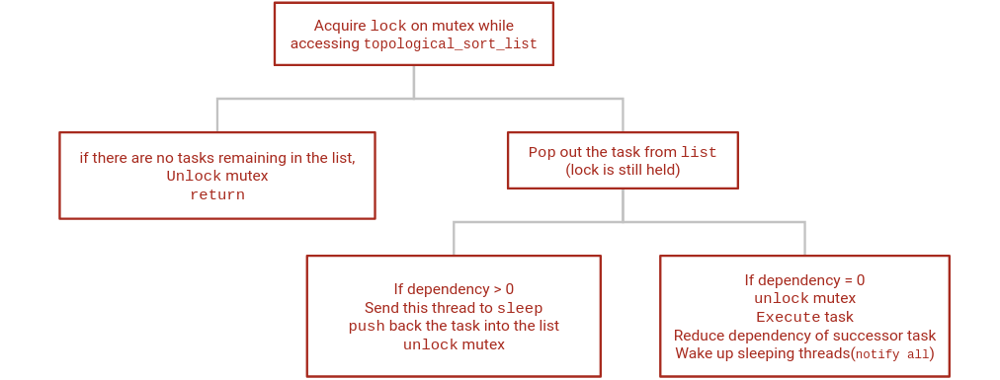
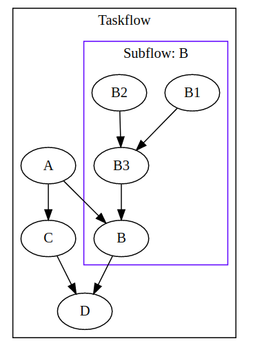
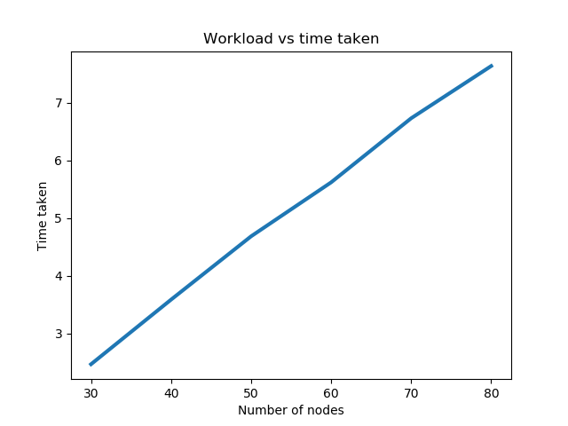
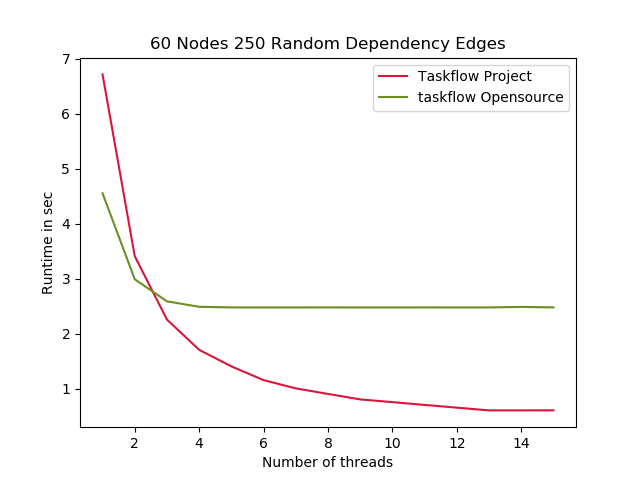

# Miniature taskflow
This project is a miniature version of Taskflow C++. 
Taskflow C++ is a library used for executing multiple heterogeneous workloads efficiently using parallel programming.


# Usage
Whole project is structured as header files. To use the project one just need to include executor.hpp in main cpp file. 
```
#include "executor.hpp"
```
For more details view example_simple.cpp. To run simple.cpp-<br>
```
g++ -pthread -o example example_simple.cpp && ./example
```
For viewing dot file you can use xdot library. <br>
```
$ dot -Tpng {Tasflow name}_graph.dot > output.png && eog output.png
``` 


## Executor Flow
Executor algorithm is depicted in the below flow chart diagram.

## Subflow and Dynamic Tasking

We provide a feature to add reusable subflow components. Subflows are a group of tasks that are associated with some task in the original taskflow graph, like in figure shown B2, B3, B1 form the subflow associated with B . Nested Subflows are also supported.    For more deatail check example_subflow.cpp.

<!--  -->


## For Each
We also provide a feature to parallelise a for loop where each iteration is independent of each other. We can create a Task for each iteration and add it to the taskflow to execute
For more details check example_foreach.cpp.

## Performance

<!--  -->


<br>
The first graph is a comparison of runtime of our version of taskflow, the red one, and the original open source taskflow, the green with increasing the number of threads spawned. This graph is obtained on running both the frameworks on a random workload generated by a python script.<br>    
The second graph shows the relationship between the work-load and time taken. We can clearly see there is a linear relationship between work-load and time taken to complete it. For generating this plot a c++ file was written and executed using a python script. For each workload 10 random graphs were generated and their average running time was considered.


<!-- {: width=20%} -->